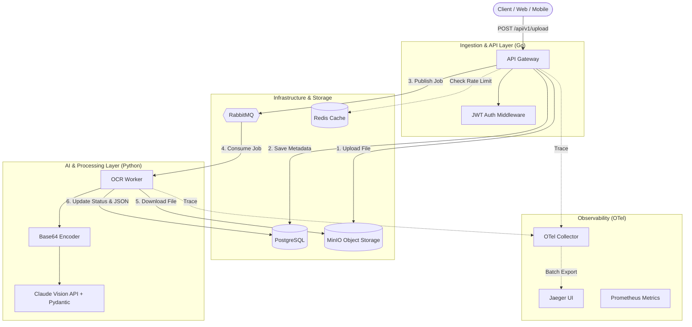

# Intelligent Document Processing (IDP) — System Architecture

---

## Document Information

| Field | Value |
| :--- | :--- |
| **Document** | IDP System Architecture |
| **Version** | `1.0.0` |
| **Author** | _<Author Name>_ |
| **Last Updated** | `2026-03-03` |
| **Status** | Living Document |

---

## Table of Contents

1. [Executive Summary](#1-executive-summary)
2. [Architectural Principles](#2-architectural-principles)
3. [High-Level Architecture](#3-high-level-architecture)
4. [Service Inventory](#4-service-inventory)
5. [Infrastructure & Storage Layer](#5-infrastructure--storage-layer)
6. [Processing Pipeline](#6-processing-pipeline)
7. [Observability Stack](#7-observability-stack)
8. [Non-Functional Requirements](#8-non-functional-requirements)
9. [Scalability Strategy](#9-scalability-strategy)
10. [Failure Handling Strategy](#10-failure-handling-strategy)
11. [Deployment Model](#11-deployment-model)

---

## 1. Executive Summary

The IDP ecosystem is a distributed microservices platform designed to **ingest, queue, process, and extract structured data** from unstructured documents (images, PDFs). Built with scalability and observability as first-class concerns, the architecture separates high-throughput API ingestion from CPU-bound AI/OCR processing through asynchronous message brokering.

The system is composed of two primary service layers:

- **AI & Processing Layer (**Python**)** — An event-driven **OCR Worker** that consumes processing jobs, applies Base64 encoding, and extracts structured JSON data using a Multimodal LLM (**Anthropic Claude Vision**) mapped via **Pydantic**.
- **Ingestion & API Layer (**Go**)** — A high-performance **API Gateway** that handles authentication, rate limiting, and job queuing.

All services are interconnected through a shared infrastructure layer comprising **PostgreSQL**, **MinIO**, **RabbitMQ**, and **Redis**, with end-to-end distributed tracing via **OpenTelemetry**.

---

## 2. Architectural Principles

| Principle | Description |
| :--- | :--- |
| **Separation of Concerns** | API ingestion and document processing are decoupled into independent, purpose-built services. |
| **Event-Driven Processing** | **RabbitMQ** decouples producers (**API Gateway**) from consumers (**OCR Worker**), enabling asynchronous workflows. |
| **Infrastructure Agnosticism** | All services are containerized and communicate via standard protocols (AMQP, HTTP, gRPC). |
| **Observability by Default** | Every service emits traces and metrics to a centralized **OpenTelemetry Collector**. |
| **Fail-Safe Design** | Services implement retries, dead-letter queues, and health checks to handle transient failures. |
| **Stateless Services** | Application services are stateless; all persistent state resides in dedicated infrastructure components. |
| **Clean Architecture (Gateway)** | The **Go** API Gateway follows Clean Architecture with explicit domain, use-case, and infrastructure layers. |

---

## 3. High-Level Architecture

The diagram below illustrates the end-to-end document processing flow, from client upload through OCR extraction, including the observability data path.



---

## 4. Service Inventory

| Service | Language | Role | Port(s) |
| :--- | :--- | :--- | :--- |
| **API Gateway** | **Go** | HTTP ingestion, authentication, job publishing | `8080` |
| **OCR Worker** | **Python** | Document Base64 encoding and Claude AI Vision extraction | — (consumer) |
| **PostgreSQL** | — | Relational metadata and result storage | `5432` |
| **Redis** | — | Caching layer and rate limiting | `6379` |
| **RabbitMQ** | — | Asynchronous message broker | `5672`, `15672` |
| **MinIO** | — | S3-compatible object storage for documents | `9000`, `9001` |
| **OTel Collector** | — | Telemetry pipeline (traces & metrics) | `4317`, `4318` |
| **Jaeger** | — | Distributed tracing UI | `16686` |
| **Prometheus** | — | Metrics collection and alerting | `9090` |

---

## 5. Infrastructure & Storage Layer

### 5.1 PostgreSQL

- **Purpose:** Persistent storage for document metadata, processing status, and extracted OCR results (structured JSON).
- **Image:** `postgres:15-alpine`
- **Initialization:** Schema bootstrapped via `database/init.sql` on first run.
- **Health Check:** `pg_isready` with `10s` interval, `5` retries.

### 5.2 Redis

- **Purpose:** Actively used for Gateway API Rate Limiting (Fixed Window Counter, e.g., 10 req/min/user) to protect downstream AI workers.
- **Image:** `redis:7-alpine`
- **Persistence:** Append-only file (AOF) enabled for durability.

### 5.3 RabbitMQ

- **Purpose:** Message broker implementing the producer–consumer pattern between the **API Gateway** and **OCR Worker**.
- **Image:** `rabbitmq:3.12-management-alpine`
- **Management UI:** Accessible on port `15672` for queue monitoring and administration.

### 5.4 MinIO (Object Storage)

- **Purpose:** S3-compatible object storage for raw document files (images, PDFs).
- **Image:** `minio/minio:latest`
- **Default Bucket:** `documents`
- **Console UI:** Accessible on port `9001`.

---

## 6. Processing Pipeline

The document processing pipeline follows a sequential, event-driven flow:

### 6.1 Ingestion Phase (API Gateway — Go)

1. **Upload Request:** Client sends a `POST /api/v1/upload` request with a document file.
2. **Authentication:** **JWT Auth Middleware** validates the request token (supports both `Authorization` header and `HttpOnly` cookies).
3. **Storage:** The **API Gateway** uploads the file to **MinIO** object storage.
4. **Metadata DB:** Document metadata (filename, upload timestamp, status) is persisted to **PostgreSQL**.
5. **Job Queue:** A processing job message is published to the **RabbitMQ** queue.
6. **Response:** The client receives an immediate acknowledgement with a document tracking ID.

### 6.2 Processing Phase (OCR Worker — Python)

1. **Job Consumption:** The **OCR Worker** consumes job messages from the **RabbitMQ** queue.
2. **Retrieve File:** The raw document file is downloaded from **MinIO**.
3. **Encoding:** The document is converted into a Base64 string via a **Base64 Encoder**.
4. **AI Extraction:** An extraction prompt and the Base64 image are sent to the **Anthropic Claude Vision API**.
5. **Data Structuring:** The LLM response is parsed and validated into strict structured JSON using **Pydantic**.
6. **Save Results:** Extracted structured JSON results are written back to **PostgreSQL**.
7. **Status Update:** Document status is updated to `completed` (or `failed` on error).

### 6.3 Trace Context Propagation

- The **API Gateway** injects W3C `traceparent` headers into **RabbitMQ** message properties.
- The **OCR Worker** extracts the trace context from consumed messages, ensuring end-to-end distributed tracing across service boundaries.

---

## 7. Observability Stack

### 7.1 Distributed Tracing

| Component | Role |
| :--- | :--- |
| **OTel Collector** | Receives OTLP spans (gRPC on `4317`, HTTP on `4318`), batches, and exports to **Jaeger**. |
| **Jaeger** | Provides a UI for trace visualization, latency analysis, and dependency mapping. |

Both the **API Gateway** (**Go**) and the **OCR Worker** (**Python**) are instrumented with **OpenTelemetry SDKs**, emitting spans for every critical operation (HTTP handling, queue publish/consume, file I/O, OCR processing).

### 7.2 Metrics

| Component | Role |
| :--- | :--- |
| **Prometheus** | Scrapes metrics endpoints exposed by services at configurable intervals. |

**Prometheus** is configured via `configs/prometheus.yml` and stores time-series data for dashboarding and alerting.

---

## 8. Non-Functional Requirements

| Requirement | Target |
| :--- | :--- |
| **Availability** | **99.9%** uptime for the **API Gateway**; **OCR Workers** are resilient to restarts via persistent queues. |
| **Latency** | **API Gateway** responds to upload requests in `< 500 ms` (excluding file transfer time). |
| **Throughput** | Horizontally scalable **OCR Workers** to handle concurrent document processing at volume. |
| **Observability** | **100%** of requests traced end-to-end; key metrics (latency, error rate, queue depth) always visible. |
| **Security** | JWT-based authentication with `HttpOnly` cookie support; all inter-service traffic on internal network. |
| **Data Durability** | **PostgreSQL** with health checks; **MinIO** for persistent object storage; **RabbitMQ** with durable queues. |
| **Portability** | Fully containerized; deployable on any Docker-compatible runtime or Kubernetes cluster. |

---

## 9. Scalability Strategy

### 9.1 Horizontal Scaling

- **OCR Workers** are stateless consumers and can be scaled independently by increasing replica count. **RabbitMQ** distributes jobs across all connected consumers using round-robin delivery.
- **API Gateway** instances can be scaled behind a load balancer (e.g., NGINX, Traefik, or a Kubernetes Ingress Controller).

### 9.2 Infrastructure Scaling

| Component | Scaling Approach |
| :--- | :--- |
| **PostgreSQL** | Vertical scaling initially; read replicas for read-heavy query patterns. |
| **RabbitMQ** | Clustering and quorum queues for high-availability message brokering. |
| **MinIO** | Distributed mode with erasure coding for storage scalability and redundancy. |
| **Redis** | **Redis** Sentinel or **Redis** Cluster for high availability and horizontal partitioning. |

### 9.3 Backpressure Management

- **Gateway Rate Limiting**: The **Go API Gateway** enforces strict **Redis**-backed Rate Limiting (Fixed Window Counter, 10 req/min) preventing abuse of the expensive Anthropic Claude downstream processing.
- **RabbitMQ** `prefetch_count` is configured on the **OCR Worker** to limit the number of in-flight messages per consumer, preventing overload under high job volume.
- Queue depth metrics are exposed to **Prometheus**, enabling auto-scaling triggers based on queue backlog.

---

## 10. Failure Handling Strategy

### 10.1 Message Processing Failures

| Mechanism | Description |
| :--- | :--- |
| **Automatic Retries** | Failed OCR jobs are retried with configurable retry count before being rejected. |
| **Dead-Letter Queue** | Messages that exhaust all retries are routed to a dead-letter exchange (DLX) for manual review. |
| **Idempotent Updates** | Database status updates are idempotent; reprocessing a job produces the same result. |

### 10.2 Service-Level Resilience

| Mechanism | Description |
| :--- | :--- |
| **Health Checks** | **PostgreSQL**, **RabbitMQ**, and **MinIO** containers expose health checks; dependent services wait for readiness. |
| **Graceful Shutdown** | Workers finish processing in-flight messages before terminating on `SIGTERM`. |
| **Connection Recovery** | AMQP and database clients implement automatic reconnection with exponential backoff. |
| **Trace on Error** | Failed operations are recorded as error spans in the distributed trace for debugging. |

### 10.3 Data Integrity

- Document status transitions follow a defined state machine: `pending` → `processing` → `completed` \| `failed`.
- File uploads to **MinIO** are validated before metadata is committed to **PostgreSQL**.
- **RabbitMQ** queues are configured as **durable** with **persistent** message delivery to survive broker restarts.

---

## 11. Deployment Model

### 11.1 Docker Compose (Development & Staging)

All services are defined in a single `docker-compose.yml` and connected via a dedicated `idp_network` bridge network. Environment variables are externalized to a `.env` file.

```bash
# Start all services
docker-compose up -d

# Scale OCR Workers
docker-compose up --scale ocr-worker=3 -d
```

### 11.2 Kubernetes (Production-Ready)

The architecture is designed for Kubernetes deployment with the following mapping:

| Docker Compose Concept | Kubernetes Equivalent |
| :--- | :--- |
| Service container | Deployment + Service |
| `docker-compose.yml` | Helm Chart / Kustomize overlay |
| `.env` file | ConfigMap + Secret |
| `idp_network` | Namespace + NetworkPolicy |
| `--scale` flag | HorizontalPodAutoscaler (HPA) |
| Volume mounts | PersistentVolumeClaim (PVC) |
| Health checks | `livenessProbe` / `readinessProbe` |

### 11.3 Container Registry

All custom service images (**API Gateway**, **OCR Worker**) should be built, tagged, and pushed to a container registry (e.g., Docker Hub, GitHub Container Registry, AWS ECR) for production deployments.

### 11.4 CI/CD Considerations

- **Build:** Multi-stage `Dockerfile`s for minimal production images.
- **Test:** Run unit and integration tests in CI before image build.
- **Deploy:** Use GitOps (e.g., ArgoCD, Flux) or CI-driven `kubectl apply` / `helm upgrade` for automated deployments.

---

> **Note:** This is a living document. As the IDP platform evolves, this architecture document should be updated to reflect new services, infrastructure changes, and architectural decisions.