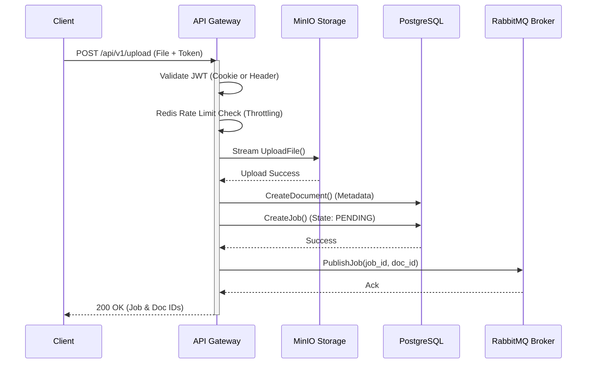

# API Gateway Service

---

## Service Overview

This service serves as the core API Gateway for the Intelligent Document Processing (IDP) Microservices ecosystem. Developed in Go (v1.25.6), it functions as a highly performant ingress point that securely handles client requests, manages user authentication, interfaces with object storage (MinIO), persists relational metadata (PostgreSQL), and asynchronously routes processing tasks to worker services via a message broker (RabbitMQ).

---

## Tech Stack

| Category | Technology | Description |
| :--- | :--- | :--- |
| **Language** | Go 1.25.6 | Core programming language |
| **Web Framework** | [Gin-Gonic] | High-performance HTTP routing |
| **Authentication** | `golang-jwt/v5` & `bcrypt` | Stateless JWT and password hashing |
| **Config Management** | `godotenv` | Environment variable management |
| **Cache & Rate Limiting** | `go-redis/v9` | Redis client for throttling |
| **Database ORM** | [GORM] | Object-Relational Mapping with PostgreSQL driver |
| **Message Broker** | `amqp091-go` | RabbitMQ client for async task queuing |
| **Object Storage** | `minio-go/v7` | MinIO client for file management |
| **API Documentation** | `swaggo/gin-swagger` | OpenAPI/Swagger auto-generation |
| **Observability** | OpenTelemetry | End-to-end tracing (`otel`, `otelgin`, `otlptracegrpc`) |

---

## Key Features

*   **Dual-Token Authentication & RBAC:** Implements a short-lived Access Token (15 min, HttpOnly cookie) and a long-lived Refresh Token (7 days, stored in Redis with key `auth:refresh:<user_id>`). The Refresh Token cookie is path-restricted to `/api/v1/auth/refresh` for enhanced security. Supports Role-Based Access Control (RBAC) via a `role` claim embedded in the JWT.
*   **Data Isolation & Ownership:** Enforces strict data isolation by binding Jobs and Documents directly to the authenticated JWT `UserID`.
*   **API Rate Limiting:** Utilizes Redis-backed middleware to enforce API rate constraints (e.g., throttling uploads to 10 requests/minute/user), ensuring equitable resource distribution and protecting costly downstream AI workers.
*   **High-Performance Routing:** Built on the Gin framework, resulting in effortless handling of concurrent HTTP requests with minimal memory overhead.
*   **Distributed Tracing:** Fully instrumented with OpenTelemetry. Trace contexts are injected into incoming HTTP requests via `otelgin.Middleware` and propagated through RabbitMQ message headers using `otel.GetTextMapPropagator()`, ensuring seamless cross-service observability.
*   **Asynchronous Processing:** Acts as the primary **Producer** for document processing operations. It securely streams file uploads to MinIO and subsequently publishes the Job context to RabbitMQ for consumption by distributed AI worker nodes.

---

## Document Upload Flow

The core responsibility of the gateway is securely orchestrating document uploads and dispatching processing jobs.



---

## Error Handling & Resiliency

The API Gateway explicitly manages failures in downstream dependencies during the document upload sequence to ensure system consistency.

> **Note: Troubleshooting Failures**
> 
> *   **MinIO Storage Failure:** Over-the-wire file stream failures to MinIO will immediately abort the operation. A `500 Internal Server Error: storage upload failed` is returned to the client, preventing orphaned metadata in the database.
> *   **PostgreSQL Database Failure:** Transaction failures during `CreateDocument` or `CreateJob` immediately abort the process. *(Future Enhancement: Implement Saga patterns to rollback/delete the orphaned MinIO object if the database transaction fails.)*
> *   **RabbitMQ Broker Failure:** If the API Gateway fails to acquire a connection to the broker or if the channel rejects the message, it returns `500 Internal Server Error: queue publish failed`. Since the Document and Job metadata have already been persisted, they will remain in a `PENDING` state in the database, requiring a retry-worker mechanism or manual intervention for re-queuing.

---

## Endpoint Specifications

| Method | Endpoint | Description | Auth Required |
| :--- | :--- | :--- | :--- |
| **POST** | `/api/v1/auth/register` | Register a new user account | No |
| **POST** | `/api/v1/auth/login` | Authenticate and set `access_token` (15m) + `refresh_token` (7d) cookies | No |
| **POST** | `/api/v1/auth/refresh` | Obtain a new `access_token` using the `refresh_token` cookie | No (Cookie) |
| **POST** | `/api/v1/auth/logout` | Invalidate refresh token in Redis and clear all auth cookies | Yes |
| **GET** | `/api/v1/users/me` | Retrieve authenticated user profile (includes `role`) | Yes |
| **POST** | `/api/v1/upload` | Upload a new document for processing | Yes |
| **GET** | `/api/v1/jobs/:id` | Poll the status of a processing job | Yes |
| **GET** | `/api/v1/jobs/:id/stream` | Subscribe to real-time SSE job status updates | Yes |

### Example JSON Responses

#### Validation/Upload Success (`POST /api/v1/upload`)
```json
{
  "doc_id": "67a32b69-58b9-4672-9014-9b5cf457c314",
  "job_id": "c62f4b4d-178b-4a5f-82ff-63205bda6128",
  "message": "Upload successful",
  "status": "PENDING"
}
```

#### Job Polling Success (`GET /api/v1/jobs/:id`)
```json
{
  "id": "c62f4b4d-178b-4a5f-82ff-63205bda6128",
  "document_id": "67a32b69-58b9-4672-9014-9b5cf457c314",
  "state": "PENDING",
  "result": null,
  "retry_count": 0,
  "error_message": "",
  "trace_id": "",
  "created_at": "2026-03-03T20:55:00Z",
  "started_at": null,
  "finished_at": null
}
```

---

## Message Queue Integration

The API Gateway acts exclusively as a **Producer** in the event-driven architecture:

*   **Exchange:** `doc_exchange`
*   **Routing Key:** `ocr_queue`
*   **Payload Schema:** A standardized JSON object encapsulating `job_id` and `doc_id`.
*   **Message Headers:** OpenTelemetry trace contexts are natively injected into the RabbitMQ `amqp.Table` headers to strictly enforce distributed cross-service tracking.

---

## Configuration & Environments

The application relies on several environment variables (`.env` or injected via Docker context) to establish downstream connections optimally:

*   **PostgreSQL:** `POSTGRES_USER`, `POSTGRES_PASSWORD`, `POSTGRES_DB`
*   **MinIO:** `MINIO_ROOT_USER`, `MINIO_ROOT_PASSWORD`
*   **RabbitMQ:** `RABBITMQ_USER`, `RABBITMQ_PASS`
*   **Security:** `JWT_SECRET` (Cryptographically signs stateless payloads)

---

## Folder Map (Clean Architecture)

The project structure rigidly adheres to Clean Architecture principles to enforce the separation of concerns.

```text
api-gateway/
├── cmd/
│   └── api/
│       └── main.go                  # Application entry point, dependency injection, and server bootstrap
├── docs/                            # Auto-generated Swagger OpenAPI specifications
└── internal/
    ├── core/
    │   ├── domain/                  # Enterprise business logic and core entities (User, Job, Document)
    │   ├── ports/                   # Interfaces and contracts for Repositories and external services
    │   ├── pkg/
    │   │   └── tracing/             # OpenTelemetry initialization abstractions
    │   └── services/                # Use case implementation (auth_service.go, idp_service.go)
    └── adapters/
        ├── handlers/                # HTTP controllers (auth_handler.go, http_handler.go)
        ├── middlewares/             # Request interceptors (JWTMiddleware, RateLimiter)
        ├── repositories/            # Data persistence layer (GORM/PostgreSQL adapters)
        ├── queue/                   # Message broker integration (RabbitMQ Producer)
        ├── storage/                 # Object storage integration (MinIO clients)
        └── cache/                   # Redis client initialization (redis_client.go)
```
---

## 🔄 Development Workflow & Applying Code Changes

When actively developing or modifying the Go API Gateway codebase, you need to ensure the changes are correctly reflected in your running environment. Choose one of the following workflows based on your requirements:

### Approach 1: Docker Rebuild (Recommended for Integration)

If you are running the entire suite via `docker-compose` and modify the Go code, the running container will still execute the old compiled binary. You must rebuild the specific gateway container:

1. Navigate to the root directory where `docker-compose.yml` is located.
2. Execute the following command to force a rebuild of the gateway image and restart the container in the background:

   ```bash
   docker compose up -d --build api-gateway
   ```

3. Docker will automatically stop the old container, compile the new Go code, and start the updated service on port `8080`.

### Approach 2: Local Execution (Fastest for Rapid Iteration)

Rebuilding Docker images for every minor code tweak can be time-consuming. For rapid iteration, you can run the Go service directly on your host machine while keeping the rest of the infrastructure (PostgreSQL, MinIO, RabbitMQ, Redis) containerized via Docker.

1. **Stop the containerized gateway** to release port `8080`:

   ```bash
   docker compose stop api-gateway
   ```

2. **Navigate** to the `api-gateway` directory:

   ```bash
   cd api-gateway
   ```

3. **Run the local Go server natively**:

   ```bash
   go run cmd/api/main.go
   ```

> **Note: Restarting the Local Server**  
> Press `Ctrl + C` in the terminal to stop the local server, and simply run the `go run` command again after making new code changes.

---

### ⚠️ Troubleshooting "Ghost Processes" (Windows)

If you encounter an `address already in use` error or CORS issues persisting after code changes, a zombie Go process might still be running in the background holding port `8080`.

1. **Find the zombie process**:
   ```cmd
   netstat -ano | findstr :8080
   ```
2. **Kill the process forcefully**:
   ```cmd
   taskkill /PID <PID_NUMBER> /F
   ```

