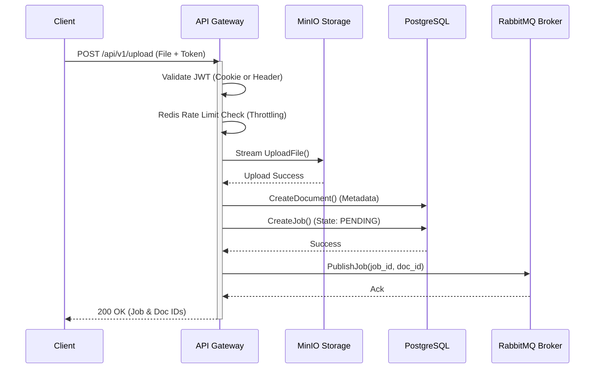

# API Gateway Service

## Service Overview
This service is the API Gateway for the Intelligent Document Processing (IDP) Microservices system. Written in Go (v1.25.6), it acts as the high-performance entry point, handling client requests securely, managing authentication, interacting with storage (MinIO), maintaining relational data (PostgreSQL), and placing tasks onto a message broker (RabbitMQ) for asynchronous processing by worker services.

## Tech Stack
*   **Language:** Go 1.25.6
*   **Web Framework:** [Gin-Gonic] (High-performance HTTP routing)
*   **Authentication:** `golang-jwt/v5` & `golang.org/x/crypto/bcrypt`
*   **Config Management:** `github.com/joho/godotenv`
*   **Cache & Rate Limiting:** `github.com/redis/go-redis/v9`
*   **Database ORM:** [GORM] with PostgreSQL driver
*   **Message Broker Client:** `amqp091-go` (RabbitMQ)
*   **Object Storage Client:** `minio-go/v7`
*   **API Documentation:** `swaggo/gin-swagger`
*   **Observability & Tracing:** OpenTelemetry (`otel`, `otelgin`, `otlptracegrpc`)

## Key Features
*   **Robust Authentication & Authorization:** Implements secure user registration (bcrypt password hashing) and login using Stateless JWT tokens. To prevent cross-site scripting (XSS) vulnerabilities, JWT tokens are securely delivered via `HttpOnly` and `Secure` cookies. A robust fallback mechanism dynamically parsing the `Authorization: Bearer <token>` header is also integrated to natively support mobile applications and third-party API clients.
*   **Data Isolation & Ownership:** Jobs and Documents are strictly bound to the authenticated JWT `UserID`, enforcing data isolation.
*   **API Rate Limiting:** A Redis-backed middleware enforces API rate limits (e.g., throttling uploads to 10 req/min/user), ensuring fair usage and protecting the expensive downstream AI Worker resources.
*   **High Performance Routing:** Built on the lightweight Gin framework, the service effortlessly handles concurrent requests with a minimal memory footprint.
*   **Distributed Tracing:** Fully instrumented with OpenTelemetry. The Gateway injects trace context into HTTP requests (`otelgin.Middleware`) and RabbitMQ message headers (`otel.GetTextMapPropagator()`), enabling precise end-to-end tracing across the microservices ecosystem.
*   **Asynchronous Processing Flow:** Acts as the primary **Producer** for document processing tasks. It securely uploads incoming documents to MinIO and subsequently pushes the Job context downstream via RabbitMQ for asynchronous distributed worker consumption.

## Document Upload Flow (Sequence Diagram)
The core responsibility of the gateway aside from Auth is securely accepting and orchestrating document uploads.



## Error Handling & Resiliency
The gateway acts as the orchestrator and handles failures in downstream dependencies explicitly during the Upload sequence:

*   **MinIO Failure:** If the file stream fails to upload to MinIO, the process aborts immediately. The database is not bloated with orphaned metadata, and a `500 Internal Server Error: storage upload failed` is returned to the client.
*   **PostgreSQL Failure:** If either the `CreateDocument` or `CreateJob` SQL transaction fails, the process aborts. (Note: A future enhancement could introduce Saga patterns or Compensating Transactions to delete the orphaned MinIO file if the DB fails).
*   **RabbitMQ Failure:** If the connection to the message broker fails or the channel rejects the message, the API returns `500 Internal Server Error: queue publish failed`. The document and job *will* exist in the database in a `PENDING` state, requiring a retry worker or manual intervention to re-queue.

## Endpoint Specifications

| Method | Endpoint | Description | Auth Required |
| :--- | :--- | :--- | :--- |
| **POST** | `/api/v1/auth/register` | Register a new user | No |
| **POST** | `/api/v1/auth/login` | Authenticate and return HttpOnly token Cookie | No |
| **POST** | `/api/v1/auth/logout` | Clear the JWT access_token cookie session | Yes |
| **GET** | `/api/v1/users/me` | Fetch the currently authenticated user profile | Yes (Cookie / Header) |
| **POST** | `/api/v1/upload` | Upload a document for Intelligent Processing | Yes |
| **GET** | `/api/v1/jobs/:id` | Poll the current processing status of a job | Yes |

### Example JSON Responses

**POST `/api/v1/upload` (Success)**
```json
{
  "doc_id": "67a32b69-58b9-4672-9014-9b5cf457c314",
  "job_id": "c62f4b4d-178b-4a5f-82ff-63205bda6128",
  "message": "Upload successful",
  "status": "PENDING"
}
```

**GET `/api/v1/jobs/:id` (Success)**
```json
{
  "id": "c62f4b4d-178b-4a5f-82ff-63205bda6128",
  "document_id": "67a32b69-58b9-4672-9014-9b5cf457c314",
  "state": "PENDING",
  "result": null,
  "retry_count": 0,
  "error_message": "",
  "trace_id": "",
  "created_at": "2026-03-03T20:55:00Z",
  "started_at": null,
  "finished_at": null
}
```

## Message Queue Integration
The API Gateway operates strictly as a **Producer**:
*   **Exchange:** `doc_exchange`
*   **Routing Key:** `ocr_queue`
*   **Payload Context:** Pushes `job_id` and `doc_id` inside a JSON payload object.
*   **Headers:** Injects OpenTelemetry trace contexts directly into RabbitMQ `amqp.Table` message headers to preserve cross-service tracking.

## Environment Variables Required
The application expects various connection strings and secrets (typically injected via `.env` or Docker configuration) to function correctly:
*   `POSTGRES_USER`, `POSTGRES_PASSWORD`, `POSTGRES_DB` (For connecting to the core PostgreSQL Database)
*   `MINIO_ROOT_USER`, `MINIO_ROOT_PASSWORD` (For authenticating with the MinIO Object Storage cluster)
*   `RABBITMQ_USER`, `RABBITMQ_PASS` (For AMQP broker connections)
*   `JWT_SECRET` (Required for the cryptographic signing of stateless JWTs)

## Folder Map
The project architecture strictly adheres to **Clean Architecture** patterns, ensuring separation of concerns:
*   `cmd/api/main.go`: The execution entry point. Bootstraps dependencies, initializes connections (DB, MinIO, RabbitMQ, Jaeger Tracer), and mounts Gin routing groups.
*   `docs/`: Contains auto-generated Swagger OpenAPI specifications.
*   `internal/core/domain/`: Defines the foundational core business entities (`User`, `Job`, `Document`).
*   `internal/core/ports/`: Establishes the interfaces (Contracts) representing required Repositories and external Services.
*   `internal/core/services/`: Houses the complex core business logic isolating it from external frameworks (`auth_service.go`, `idp_service.go`).
*   `internal/core/pkg/tracing/`: Abstractions for OpenTelemetry initialization and configurations.
*   `internal/adapters/handlers/`: Contains the HTTP controllers (`auth_handler.go`, `http_handler.go`) designed to parse requests and trigger service logic.
*   `internal/adapters/middlewares/`: Implements the `JWTMiddleware` capable of Token extraction (Cookie/Header) and payload verification, and `rate_limit_middleware.go` for Redis throttling.
*   `internal/adapters/repositories/`: Implements the `UserRepository` and `DocumentRepository` interfaces translating operations into precise GORM/Postgres SQL queries.
*   `internal/adapters/queue/`: Implements `RabbitMQProducer`, translating application jobs into RabbitMQ AMQP publications.
*   `internal/adapters/storage/`: Implements `MinIOStorage`, providing an S3 compatible layer for saving uploaded files.
*   `internal/adapters/cache/`: Contains the initialization logic for the Redis client (`redis_client.go`).
